# Backlog Synthesizer — Architecture

> Render this file in VS Code with the **Markdown Preview Mermaid Support** extension,
> or open it on GitHub / any Mermaid-aware viewer.

```mermaid
flowchart TB
    %% ─────────────────────────────────────────────────────────────────
    %% STYLE DEFINITIONS
    %% ─────────────────────────────────────────────────────────────────
    classDef ui        fill:#4A90D9,stroke:#2C5F8A,color:#fff,rx:6
    classDef auth      fill:#7B68EE,stroke:#5A4DB0,color:#fff,rx:6
    classDef input     fill:#5BAD6F,stroke:#3D8050,color:#fff,rx:6
    classDef guard     fill:#C0392B,stroke:#922B21,color:#fff,rx:6
    classDef orch      fill:#E8A838,stroke:#B07820,color:#fff,rx:6
    classDef node_box  fill:#F5C842,stroke:#B07820,color:#333,rx:4
    classDef agent     fill:#E06C3B,stroke:#A04820,color:#fff,rx:6
    classDef tool      fill:#D95F5F,stroke:#A03030,color:#fff,rx:6
    classDef provider  fill:#888,stroke:#555,color:#fff,rx:6
    classDef memory    fill:#4BACC6,stroke:#2980B9,color:#fff,rx:6
    classDef integ     fill:#70AD47,stroke:#3D8050,color:#fff,rx:6
    classDef output    fill:#5B9BD5,stroke:#2E75B6,color:#fff,rx:6
    classDef eval      fill:#9B59B6,stroke:#6C3483,color:#fff,rx:6
    classDef obs       fill:#1ABC9C,stroke:#148F77,color:#fff,rx:6
    classDef preset    fill:#F39C12,stroke:#B7770D,color:#fff,rx:4
    classDef infra     fill:#34495E,stroke:#1A252F,color:#fff,rx:6
    classDef budget    fill:#E74C3C,stroke:#A93226,color:#fff,rx:6
    classDef cicd      fill:#2ECC71,stroke:#1A8A4A,color:#fff,rx:6

    %% ─────────────────────────────────────────────────────────────────
    %% LAYER 0 — USER ENTRY POINTS
    %% ─────────────────────────────────────────────────────────────────
    subgraph ENTRY["  User Entry Points  "]
        direction LR
        WEB["🖥️ Streamlit Web UI\napp.py · port 8502"]:::ui
        CLI_["⌨️ CLI\nsrc/main.py"]:::ui
    end

    %% ─────────────────────────────────────────────────────────────────
    %% LAYER 2 — PRE-RUN GATES
    %% ─────────────────────────────────────────────────────────────────
    subgraph GATES["  Pre-Run Gates (app.py)  "]
        direction LR
        STARTUP["🔍 Startup Checks\nstartup_check.py\ncheck_required_secrets()\ncheck_secret_formats()\nChromaDB SPOF warn"]:::guard
        RATELIMIT["🚦 Rate Limiter\nbudget_store.py\ncheck_rate_limit()\nMAX_SYNTHESES_PER_HOUR\nMAX_SYNTHESES_PER_DAY"]:::budget
        BUDGET["💰 Budget Gate\nbudget_store.py\ntry_reserve() atomic\nRedis Lua script\nfile fallback"]:::budget
        IDEMPOTENT["🔁 Idempotency\nSHA-256 input hash\n60-second dedup\nwindow"]:::guard
        SEMAPHORE["⚙️ Concurrency\nthreading.Semaphore\nMAX_CONCURRENT\n_SYNTHESES=3"]:::guard
    end

    %% ─────────────────────────────────────────────────────────────────
    %% LAYER 3 — INPUTS
    %% ─────────────────────────────────────────────────────────────────
    subgraph INPUTS["  Input Sources  "]
        direction LR
        TRANSCRIPT["📄 Transcripts\n.txt / .md / .pdf"]:::input
        WIKI["📋 Architecture Wiki\n.md constraints"]:::input
        BACKLOG["🎫 Existing Backlog\nJIRA / GitHub JSON"]:::input
        IMAGES["🖼️ Visual Attachments\n.png / .jpg whiteboard"]:::input
    end

    %% ─────────────────────────────────────────────────────────────────
    %% LAYER 4 — SECURITY SCANNING
    %% ─────────────────────────────────────────────────────────────────
    subgraph SECURITY["  Security Layer (src/security.py)  "]
        direction LR
        SANITIZER["🛡️ InputSanitizer\n8 injection rules\nPII / prompt injection\ntoxicity · redact"]:::guard
        OUTSCANNER["🔎 OutputScanner\nGuardrail findings\nhallucination check\nbias detection"]:::guard
        SEC_ALERT["🚨 Alerts\nalerts.py\nSlack / MS Teams\nPagerDuty webhook"]:::guard
    end

    %% ─────────────────────────────────────────────────────────────────
    %% LAYER 5 — ORCHESTRATION (LangGraph)
    %% ─────────────────────────────────────────────────────────────────
    subgraph ORCH["  Orchestration — LangGraph StateGraph (pipeline.py)  "]
        direction TB
        ORCH_WRAP["📦 Orchestrator\norchestrator.py\nbackward-compat wrapper\nroot pipeline.run OTel span"]:::orch
        PIPELINE["⚙️ build_pipeline()\nStateGraph compile\n+ MemorySaver"]:::orch
        STATE["📐 PipelineState TypedDict\nmemory/state.py\n24 typed fields"]:::orch

        subgraph NODES["  7 LangGraph Nodes — each wrapped with _node_with_span()  "]
            direction LR
            N0["1️⃣\ninitialize\nlive fetch +\nOTel span"]:::node_box
            N1["2️⃣\nparse\ntopics from\ntranscript"]:::node_box
            N2["3️⃣\nextract_\nconstraints"]:::node_box
            N3["4️⃣\nwrite_\nstories"]:::node_box
            N4["5️⃣\ndecompose_\nepics"]:::node_box
            N5["6️⃣\ndetect_\ngaps"]:::node_box
            N6["7️⃣\nfinalize\nguardrails +\ntoken tally"]:::node_box
            N0 --> N1 --> N2 --> N3 --> N4 --> N5 --> N6
        end
    end

    %% ─────────────────────────────────────────────────────────────────
    %% LAYER 6 — AGENTS
    %% ─────────────────────────────────────────────────────────────────
    subgraph AGENTS["  Agent Layer (src/agents/)  "]
        direction LR
        A1["🔍 Discovery Engine\nTopics + quotes\n+ summary"]:::agent
        A2["⚖️ Policy Engine Agent\nRules / limits\ncompliance"]:::agent
        A3["✍️ Story Generation Agent\nGiven/When/Then AC\npriority + evidence"]:::agent
        A4["🏗️ Delivery Planner Agent\nGroup stories\n+ tasks"]:::agent
        A5["🔎 Insight Scanner Agent\nDuplicates · Conflicts\nCoverage gaps\nmax_tokens=8000"]:::agent
    end

    %% ─────────────────────────────────────────────────────────────────
    %% LAYER 7 — LLM TOOLS + CIRCUIT BREAKER
    %% ─────────────────────────────────────────────────────────────────
    subgraph TOOLS["  LLM Tool Layer — LangChain Providers + Circuit Breaker  "]
        direction LR
        CB["⚡ Circuit Breaker\ncircuit_breaker.py\nCLOSED/OPEN/HALF_OPEN\nCLAUDE_CB · GEMINI_CB\nthreadsafe probe lock"]:::guard
        CT["🟣 ClaudeTool\nlangchain-anthropic\nPrompt caching\nVision · max_retries=3"]:::tool
        GT["🔵 GeminiTool\nlangchain-google-genai\nJSON mode · max_retries=3"]:::tool
        ET["📊 EmbeddingTool\nsentence-transformers\nall-MiniLM-L6-v2\nlocal, no LLM cost"]:::tool
    end

    %% ─────────────────────────────────────────────────────────────────
    %% MODEL PRESETS
    %% ─────────────────────────────────────────────────────────────────
    subgraph PRESETS["  Model Presets (app.py)  "]
        direction LR
        P_FREE["🟢 Open\nAll Gemini Flash\n~$0.01/run"]:::preset
        P_BAL["⚡ Hybrid\nGemini + Claude\n~$0.20/run"]:::preset
        P_PREM["👑 Elite\nAll Claude Sonnet\n~$0.80/run"]:::preset
    end

    %% ─────────────────────────────────────────────────────────────────
    %% EXTERNAL LLM PROVIDERS
    %% ─────────────────────────────────────────────────────────────────
    subgraph PROVIDERS["  External LLM Providers  "]
        direction LR
        CLAUDE_API["☁️ Anthropic\nclaude-sonnet-4-5\nclaude-haiku-4-5"]:::provider
        GEMINI_API["☁️ Google AI\ngemini-2.5-flash\ngemini-2.5-pro"]:::provider
    end

    %% ─────────────────────────────────────────────────────────────────
    %% MEMORY & STATE
    %% ─────────────────────────────────────────────────────────────────
    subgraph MEMORY["  Memory & State Layer  "]
        direction LR
        STORE["🗄️ MemoryStore\nmemory/store.py\nKV handoff + vector search\nChromaDB HttpClient (HA)\nor PersistentClient (local)"]:::memory
        AUDIT_LOG["📜 AuditLog\nmemory/audit_log.py\nSQLite + SHA-256\nhash chain · tamper-evident"]:::memory
        LANGGRAPH_STATE["🔗 LangGraph State\nMemorySaver\nin-process per thread_id"]:::memory
    end

    %% ─────────────────────────────────────────────────────────────────
    %% BUDGET & RATE STORE
    %% ─────────────────────────────────────────────────────────────────
    subgraph BUDGETSTORE["  Budget & Rate Store (budget_store.py)  "]
        direction LR
        REDIS_STORE["🔴 Redis\nbudget:<user>:<date>\nrate:<user>:h:<hour>\nrate:<user>:d:<date>\nLua atomic reserve"]:::budget
        FILE_STORE["📁 File Fallback\nper-user JSON files\nthreading.Lock\nsingle-pod only"]:::budget
        SETTLE["✅ settle_reservation()\nactual − estimated\nrefund unused reserve"]:::budget
    end

    %% ─────────────────────────────────────────────────────────────────
    %% ENTERPRISE INTEGRATIONS
    %% ─────────────────────────────────────────────────────────────────
    subgraph INTEGRATIONS["  Enterprise Integrations  "]
        direction LR
        JIRA_T["🎫 JiraTool\nREST API\nLive read + publish\nMock fallback"]:::integ
        CONF_T["📖 ConfluenceTool\nREST API\nFetch wiki pages\nMock fallback"]:::integ
        MCP_T["🔗 MCP Atlassian\nmcp-atlassian server\nModel Context Protocol\nPython 3.10+"]:::integ
    end

    subgraph EXTERNAL["  External Systems  "]
        direction LR
        JIRA_EXT["Jira Cloud\natlassian.net"]:::provider
        CONF_EXT["Confluence Cloud\natlassian.net"]:::provider
    end

    %% ─────────────────────────────────────────────────────────────────
    %% OUTPUTS
    %% ─────────────────────────────────────────────────────────────────
    subgraph OUTPUTS["  Synthesis Outputs  "]
        direction LR
        JSON_OUT["📦 synthesis.json\nEpics / Stories / Tasks\nGaps / Conflicts / Dups"]:::output
        MD_OUT["📝 synthesis.md\nHuman-readable report"]:::output
        AUDIT_OUT["🔒 audit_trail.md\nFull reasoning chain\ncompliance record"]:::output
    end

    %% ─────────────────────────────────────────────────────────────────
    %% OBSERVABILITY
    %% ─────────────────────────────────────────────────────────────────
    subgraph OBS["  Observability  "]
        direction LR
        OTEL["📡 OpenTelemetry\npipeline.run root span\npipeline.node.* per node\nOTEL_ENABLED=1 · OTLP"]:::obs
        PROM["📊 Prometheus\nsrc/metrics.py\nport 9090 /metrics\nACTIVE_SYNTHESIS\nSYNTHESIS_DURATION\nLLM_ERRORS_TOTAL\nCOST_USD_TOTAL"]:::obs
        LOGGER["📋 Structured Logger\nlogger_setup.py\nRich console output"]:::obs
    end

    %% ─────────────────────────────────────────────────────────────────
    %% EVALUATION HARNESS
    %% ─────────────────────────────────────────────────────────────────
    subgraph EVAL["  Evaluation Harness  "]
        direction LR
        GOLDEN["🏆 10 Golden Cases\nevaluation/golden_dataset/\nnegative / conflict /\ncompliance cases"]:::eval
        METRICS["📏 Deterministic Metrics\nevaluation/metrics.py\nstory count · AC coverage\nconflict recall · precision · F1"]:::eval
        JUDGE["⚖️ LLM-as-Judge\nevaluation/llm_as_judge.py\n5 quality dimensions"]:::eval
        DASH["📈 Regression Dashboard\nevaluation/dashboard.py\ndrop ≥0.10 → CI fail"]:::eval
    end

    %% ─────────────────────────────────────────────────────────────────
    %% CI / CD
    %% ─────────────────────────────────────────────────────────────────
    subgraph CICD["  CI / CD (.github/workflows/)  "]
        direction LR
        CI["🧪 ci.yml\nruff · pytest · bandit\npip-audit · TruffleHog\nDocker build verify\neval suite (gated)"]:::cicd
        CD_AWS["🟠 cd-aws.yml\nBuild → ECR\nSSH deploy → EC2\nsmoke test :8502"]:::cicd
        CD_AZ["🔵 cd-azure.yml\nBuild → ACR\ncanary 10% → verify\n→ promote 100%\nmanual dispatch"]:::cicd
        SECRET_ROT["🔑 secret-rotation-check.yml\nWeekly Monday 08:00 UTC\nAPI key liveness check\nKey Vault expiry (14d)\nSlack/Teams alert\nAuto GitHub issue"]:::cicd
    end

    %% ─────────────────────────────────────────────────────────────────
    %% DATA FLOW CONNECTIONS
    %% ─────────────────────────────────────────────────────────────────

    %% Entry → Gates (no auth — AUTH_DISABLED=1)
    WEB -->|"no auth"| STARTUP
    STARTUP -->|"warnings"| RATELIMIT
    RATELIMIT -->|"allowed"| BUDGET
    BUDGET -->|"reserved"| IDEMPOTENT
    IDEMPOTENT --> SEMAPHORE

    %% Entry + Inputs → Gates
    TRANSCRIPT & WIKI & BACKLOG & IMAGES -->|"input_loader.py"| SANITIZER
    SANITIZER -->|"redacted text"| SEMAPHORE

    %% Security alerts
    SANITIZER -->|"error findings"| SEC_ALERT
    OUTSCANNER -->|"error findings"| SEC_ALERT

    %% Presets → Orchestrator
    PRESETS -->|"resolved_models dict"| ORCH_WRAP

    %% Gates → Orchestration
    SEMAPHORE -->|"models, inputs, user_email"| ORCH_WRAP

    %% Orchestration internals
    ORCH_WRAP -->|"build_pipeline().invoke(state)"| PIPELINE
    PIPELINE --> STATE & NODES

    %% Nodes → Agents
    N1 -->|"DiscoveryEngine"| A1
    N2 -->|"PolicyEngineAgent"| A2
    N3 -->|"StoryGenerationAgent"| A3
    N4 -->|"DeliveryPlannerAgent"| A4
    N5 -->|"InsightScannerAgent"| A5

    %% Agents → LLM Tools (via circuit breaker)
    A1 & A2 & A3 & A4 & A5 -->|"tool.call_for_json()"| CB
    CB -->|"CLOSED / probe"| CT & GT
    A5 -->|"find_duplicates()"| ET

    %% LLM Tools → Providers
    CT -->|"max_retries=3"| CLAUDE_API
    GT -->|"max_retries=3"| GEMINI_API

    %% Agents ↔ Memory
    A1 & A2 & A3 & A4 & A5 -->|"memory.put()"| STORE
    STORE -->|"memory.get()"| A1 & A2 & A3 & A4 & A5
    STORE --> LANGGRAPH_STATE

    %% Agents → Audit
    A1 & A2 & A3 & A4 & A5 -->|"audit.record()"| AUDIT_LOG

    %% Integrations
    N0 -->|"live_confluence_page_id"| CONF_T
    N0 -->|"live_jira=True"| JIRA_T
    A5 -->|"jira.list_all()"| JIRA_T
    JIRA_T & CONF_T --> MCP_T
    JIRA_T -->|"REST"| JIRA_EXT
    CONF_T -->|"REST"| CONF_EXT
    MCP_T -->|"MCP"| JIRA_EXT & CONF_EXT

    %% Finalize → outputs
    N6 -->|"guardrails.py"| OUTSCANNER
    OUTSCANNER --> JSON_OUT & MD_OUT
    AUDIT_LOG -->|"render_markdown()"| AUDIT_OUT

    %% Budget settle after run
    ORCH_WRAP -->|"cost_usd + increment_request_count()"| SETTLE
    SETTLE --> REDIS_STORE
    REDIS_STORE -.->|"fallback"| FILE_STORE
    RATELIMIT & BUDGET --> REDIS_STORE

    %% Observability
    ORCH_WRAP -->|"pipeline.run span"| OTEL
    N0 & N1 & N2 & N3 & N4 & N5 & N6 -->|"pipeline.node.* span"| OTEL
    CT & GT & OT -->|"llm.call span"| OTEL
    ORCH_WRAP -->|"record_synthesis_*()"| PROM
    ORCH_WRAP --> LOGGER

    %% Evaluation
    JSON_OUT -->|"compare vs expected"| GOLDEN
    GOLDEN --> METRICS & JUDGE
    METRICS & JUDGE --> DASH

    %% CI/CD
    CI -->|"gates deploy"| CD_AWS & CD_AZ
    SECRET_ROT -.->|"weekly check"| CLAUDE_API & GEMINI_API
```



---

## Layer Reference

| Layer | Files | Responsibility |
|---|---|---|
| **User Interface** | `app.py` | Streamlit UI (rate-limit badge, budget gate, guardrails tab, audit trail) |
| **Authentication** | — | No auth wall (`AUTH_DISABLED=1`) — local/internal use assumed |
| **Pre-Run Gates** | `app.py`, `src/startup_check.py`, `src/budget_store.py` | Startup validation, secret format checks, rate limit, atomic budget reserve, idempotency dedup, concurrency semaphore |
| **Security** | `src/security.py`, `src/alerts.py` | Input sanitisation (8 injection rules), output guardrail scanning, Slack/Teams/PagerDuty alerts |
| **Orchestration** | `src/orchestrator.py`, `src/pipeline.py` | LangGraph StateGraph, root OTel span, backward-compat wrapper |
| **Pipeline Nodes** | `src/pipeline.py` (`_node_with_span`) | 7 nodes each wrapped with per-node OTel span, output attribute annotations |
| **Agents** | `src/agents/*.py` (5 files) | Specialized reasoning per stage |
| **LLM Tools** | `src/tools/claude_tool.py`, `gemini_tool.py` | LangChain-backed provider wrappers, max_retries=3 |
| **Circuit Breaker** | `src/circuit_breaker.py` | CLOSED/OPEN/HALF_OPEN per provider, thread-safe probe exclusivity |
| **Embedding** | `src/tools/embedding_tool.py` | Local sentence-transformers for duplicate detection (no LLM cost) |
| **Memory** | `src/memory/store.py`, `audit_log.py`, `state.py` | KV handoff, ChromaDB HA (HttpClient/PersistentClient), tamper-evident audit |
| **Budget & Rate** | `src/budget_store.py` | Redis Lua atomic reserve/settle, hourly/daily request counters, file fallback |
| **Integrations** | `src/tools/jira_tool.py`, `confluence_tool.py`, `mcp_atlassian_tool.py` | Atlassian REST + MCP Protocol |
| **Observability** | `src/telemetry.py`, `src/metrics.py`, `src/logger_setup.py` | OTel per-node spans + root span, Prometheus metrics (port 9090), structured logs |
| **Evaluation** | `evaluation/*.py` + `golden_dataset/` | 10 golden cases, 8 deterministic metrics (incl. conflict precision + F1), LLM-as-judge, regression dashboard |
| **Tests** | `tests/` | Unit, load/soak (circuit breaker + atomic budget), security, vision |
| **CI/CD** | `.github/workflows/` | Lint + test + security scan · AWS (ECR → EC2) + Azure (ACR → Container Apps) deploy · weekly secret rotation |

---

## Data Flow Summary

```
User (no auth wall — AUTH_DISABLED=1)
         │
    Startup checks: secret formats, ChromaDB SPOF warning
         │
    Pre-run gates: rate limit → atomic budget reserve → dedup → semaphore
         │
    Input sources: Transcript + Wiki + Backlog + Images
         │
    InputSanitizer (8 injection rules — redact before any LLM sees the text)
         │
    Orchestrator.run()  ←── model preset selection
         │                    root pipeline.run OTel span
    LangGraph pipeline.invoke()
         │
    ┌──────────────────────────────────────────────────────────────────┐
    │  initialize → parse → constraints → stories → epics → gaps →    │
    │  finalize                                                        │
    │                                                                  │
    │  Each node: _node_with_span() wraps → AgentX.run()              │
    │             → memory.put() → OTel span attributes annotated      │
    │                                                                  │
    │  LLM calls: CircuitBreaker gate → ClaudeTool / GeminiTool        │
    │             → provider API (max_retries=3)                       │
    └──────────────────────────────────────────────────────────────────┘
         │
    OutputScanner (guardrail findings → Slack/PagerDuty alert if error)
         │
    output_formatter.py
         │
    synthesis.json + synthesis.md + audit_trail.md
         │
    settle_reservation(actual_cost) → increment_request_count()
         │
    Prometheus metrics recorded · OTel trace exported
```

---

## Key Configuration Variables

| Variable | Default | Purpose |
|---|---|---|
| `MAX_SYNTHESES_PER_HOUR` | `0` (disabled) | Per-user hourly request rate limit |
| `MAX_SYNTHESES_PER_DAY` | `0` (disabled) | Per-user daily request rate limit |
| `DAILY_BUDGET_USD` | `0` (disabled) | Per-user daily spend cap in USD |
| `MAX_CONCURRENT_SYNTHESES` | `3` | Process-level concurrency semaphore |
| `OTEL_ENABLED` | `0` | Enable OpenTelemetry span export |
| `REDIS_URL` | _(unset)_ | Redis for cross-pod budget + rate counters |
| `REDIS_REQUIRED` | `0` | Fail startup if Redis unreachable |
| `CHROMADB_SERVER_URL` | _(unset)_ | External ChromaDB server (HA mode) |
| `USE_CHROMADB` | `0` | Enable ChromaDB vector store |
| `ANTHROPIC_API_KEY` | _(required)_ | Anthropic Claude API key |
| `GOOGLE_API_KEY` | _(optional)_ | Google Gemini API key — injected as Container App secret (`secretref:google-api-key`) on Azure |
| `ENTRA_REDIRECT_URI` | `http://localhost:8502/` | OAuth2 callback URI — injected dynamically from Azure Container App FQDN at deploy time |
| `MAX_INPUT_TOKENS_PER_RUN` | `50000` | Input size pre-flight guard |
| `SYNTHESIS_TIMEOUT_SECONDS` | `600` | Auto-cancel wall-clock timeout |

---

## CI/CD Pipeline

```
Push to main / Pull Request
         │
    ci.yml
    ├── ruff check (F, E9) — pyflakes + syntax
    ├── pytest (Python 3.11 + 3.13 matrix)
    ├── bandit SAST (medium+ severity)
    ├── pip-audit CVE scan
    ├── TruffleHog secret scan
    ├── requirements-lock.txt freshness check
    └── Docker build verification (no push)
         │
    (on push to main only)
    └── eval-suite — 10 golden cases, regression dashboard

Auto on push to main:
    cd-aws.yml    →  build → ECR push → SSH deploy EC2 → smoke test :8502

Manual: workflow_dispatch
    cd-azure.yml  →  canary 10% → verify → promote 100% (Azure Container Apps)

Weekly (Monday 08:00 UTC):
    secret-rotation-check.yml
    ├── ANTHROPIC_API_KEY liveness (POST /v1/models)
    ├── GOOGLE_API_KEY liveness
    ├── JIRA_API_TOKEN liveness
    ├── Azure Key Vault expiry (14-day threshold)
    └── Slack/Teams alert + auto GitHub issue on failure
```
